# Progetto Programmazione e Laboratorio A.A. 2023/2024

Lo scopo del progetto è scrivere due container `trie<T>` (container principale) e `bag<T>` (container di supporto). Per costruire il container `trie<T>` si deve eseguire il parsing di un file formattato appositamente, mediante una grammatica context-free.

Di seguito speghiamo:

1. Il significato del tipo di dato `trie<T>`
2. Il formato testuale su cui eseguire il parsing.
3. Quali operazioni sono supportate dal container.
4. Istruzioni su consegna e valutazione del progetto.

## 1. Definizioni

Il container `trie<T>` deve essere internamente implementato come un *albero*.

In Informatica, un albero è un insieme di *nodi* e *archi*.
Gli archi connettono tra loro i nodi. Usando una definizione ricorsiva, possiamo dire che un albero è:

- un nodo denominato "padre", `p`;
- esso ha 0 o più "figli";
- i figli sono a loro volta degli alberi;
- per ogni figlio `c`, esiste un arco `(p,c)` che connette il padre `p` al figlio `c`.

In particolare, esiste sempre un nodo senza padre chiamato la *radice* dell'albero; i nodi senza figli sono chiamati *foglie*.

Il container `trie<T>` implementa un albero in cui gli archi sono etichettati con un valore di tipo `T` e in cui le foglie sono etichettate con un valore di tipo `double`. Per esempio, Figura 1 è una rappresentazione grafica del contenuto di un `trie<char>`.

	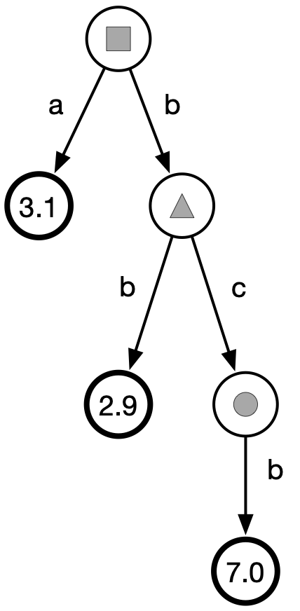
 	 
  	Figura 1: Un esempio grafico di trie&lt;char&gt. Il padre del nodo contrassegnato con il pallino è il nodo contrassegnato con il triangolo. La radice è il nodo contrassegnato con il quadrato. Le foglie sono tutti i nodi che contengono un valore double. 

Un `trie<T>` corrisponde ad un insieme di sequenze di valori di tipo `T` dove ogni sequenza ha un *peso*. Esiste una sequenza per ogni foglia dell'albero. Il peso di una sequenza è il valore double memorizzato nella foglia corrispondente.

Una sequenza è logicamente ottenuta *concatenando* le etichette su ogni arco incontrato lungo un cammino dalla radice alla corrispondente foglia.
Per esempio, il `trie<char>` di Figura 1 rappresenta il seguente insieme (per semplicità, le sequenze di `char` sono visualizzate come una stringa):

	{(a,3.1), (bb,2.9), (bcb,7.0)}

Ossia, l'insieme composto dalla sequenza `a` di peso `3.1`, dalla sequenza `bb` di peso `2.9`, e dalla sequenza `bcb` di peso `7.0`.

## 2. Sintassi del formato di file associato a `trie<T>`

Il tipo `T` deve soddisfare i seguenti requisiti
affinchè `trie<T>` sia ben definito:

- Il tipo `T` deve definire `operator<`, `operator==`,  `operator<<`, e `operator>>`. Per l'operazione in Sezione 3.9.2. (facoltativa), si richiede anche `operator+`.
- Gli oggetti di tipo `T`, quando scritti su un `std::ostream` (tramite `operator<<`), non devono contenere separatori (spazi, tab, newline, etc.). 

Per esempio, `T=double` soddisfa i requisiti sopra. Anche `T=std::string` li soddisfa, a patto che le stringhe non contengano separatori.

Secondo la definizione ricorsiva data sopra, il caso base di `trie<T>` è una foglia. Una foglia viene rappresentata testualmente come segue:

	x children = {}

dove `x` sarà un certo numero `double`. Per esempio, il seguente è un file valido in formato `trie<T>` (indipendentemente dal tipo `T`):

	17.5 children = {}

Un nodo interno del formato associato a `trie<T>` viene invece codificato testualmente come

	children = { x1 trie1, x2 trie2, ... }

dove `children` è la lista di figli del nodo; `x1`, `x2`, ... sono valori *distinti* (importante! valori ripetuti tra i figli sono da considerarsi un errore di formato) di tipo `T` che etichettano gli archi entranti nei figli e `trie1`, `trie2`, ... sono (ricorsivamente) i figli del nodo (dei `trie<T>`).
Notare che le coppie `x trie` sono separate da una virgola. Per esempio, il seguente è un file valido in formato `trie<char>` che rappresenta il trie di Figura 1.

	children = {
	  a children = {
		3.1 children = {}
	  },
	  b children = {
		b 2.9 children = {},
		c children = {
			b 7.0 children = {}
		}
	  }
	}

**Nota:** Il formato testuale può contenere spazi/tab/newline in qualsiasi punto, eccetto all'interno della parola chiave `children` e (ovviamente) all'interno dei numeri `double`.

Un altro esempio. Il seguente è un file valido per un `trie<double>`.

	children = {
	  3.14 17.0 children = {},
	  2.71 children = { 1.61 children = { 9.8 16.1 children = {} } },
	  6.67 42.5 children = {}
	}

La rappresentazione grafica del `trie<double>` dell'esempio precedente è mostrato in Figura 2.

	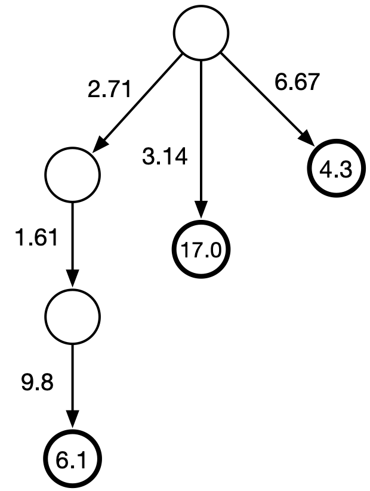
 	 
  	Figura 2: esempio di trie&lt;double&gt;

L'insieme corrispondente al trie di Figura 2 è `{(<2.71,1.61,9.8>,6.1), (<3.14>,17.0), (<6.67>,4.3)}`, dove la notazione `<x,y,z,...>` indica una sequenza di elementi (ossia, la notazione `(<2.71,1.61,9.8>,6.1)` indica la sequenza di peso `6.1` formata dai tre valori `2.71`, `1.61`, e `9.8`).

Il seguente è un file valido in formato `trie<std::string>`.

	children = {
		languages children = { c++ 1.1 children = {}, java 0.5 children = {} },
		compilers children = { g++ 2.8 children = {}, javac 3.1 children = {} }
	}

La rappresentazione grafica del `trie<std::string>` dell'esempio precedente è quella di Figura 3.

	
 	 
  	Figura 3: esempio di trie&lt;std::string&gt;

L'insieme corrispondente al trie di Figura 3 è

	{(<compilers,g++>,2.8), (<compilers,javac>,3.1), (<languages,c++>,1.1), (<languages,java>,0.5)}

**Nota:** Il tipo `T` deve essere noto al compilatore. Quindi testerete la correttezza del contenitore `trie<T>` su file che contengono valori parsabili come `T`. Ad esempio, il file in Figura 3 può soltanto essere parsato correttamente da `trie<std::string>` e non da `trie<int>` o altri. Vi forniremo degli esempi di files su cui testare il vostro contenitore dove il tipo `T` si deduce dal nome del file (ad esempio, `trie_char.tr`, `trie_int.tr`, etc.).

**Operatori su stream**

I metodi esterni

	template <typename T>
	std::ostream& operator<<(std::ostream&, trie<T> const&);
	
	template <typename T>
	std::istream& operator>>(std::istream&, trie<T>&);

Devono, rispettivamente, scrivere un `trie<T>` su `std::ostream` e leggere un `trie<T>` da `std::istream` nel formato descritto in questa sezione. Come mostrato a lezione, il metodo `operator>>` invocherà un parser per il formato di file testuale descritto, implementato mediante un'apposita grammatica context-free.

## 3. Container `trie<T>`

Il container ha il seguente scheletro, come descritto nel
file `include/trie.hpp`.

	template <typename T>
	struct trie {
	
		/* methods and iterators */
	
	private:
		trie<T>* m_p;      // parent
		T* m_l;            // label
		bag<trie<T>> m_c;  // children
		double m_w;        // weight
	};

Siete liberi di implementare a vostro piacimento il container `bag`, che mantiene l'insieme dei nodi figli ordinati per etichetta crescente (usando opportunatamente `operator<` definito su `T`). Notate the `trie.hpp` include `bag.hpp`. Dovrete implementare `bag.hpp` in maniera *header-only*, ossia dichiarazione e definizione del container devono essere entrambe presenti in `include/bag.hpp`. 

**Importante:** Il file `trie.hpp` non va modificato in alcun modo. In particolare, non potete aggiungere membri di classe (nuove attributi, funzioni, tipi). Compileremo il codice usando la versione di `trie.hpp` contenuta su questo repository, quindi se fate delle modifiche a questo file, con ogni probabilità il vostro codice non compilerà sul nostro sistema.

**Importante:** Non potete includere librerie aggiuntive in `trie.cpp` e in `bag.hpp` (solo quelle già presenti). In fase di compilazione elimineremo ulteriori `#include`! 

Di seguito descriviamo i metodi di `trie<T>`.

### 3.1. Costruttore di default e distruttore

	template <typename T>
	trie<T>::trie();
	
	template <typename T>
	trie<T>::~trie();

Il costruttore di default deve costruire un trie corrispondente al seguente file.

	0.0 children = {}

### 3.2. Conversion constructor da double

	template <typename T>
	trie<T>::trie(double w);

Costruisce una foglia con peso pari all'argomento `w`. Per esempio, `trie<char>::trie(5.1)` deve costruire un trie corrispondente al seguente file:

	5.1 children = {}

### 3.3. Copy/move semantics

	template <typename T>
	trie<T>::trie(trie<T> const&);
	
	template <typename T>
	trie<T>::trie(trie<T>&&);
	
	template <typename T>
	trie<T>& trie<T>::operator=(trie<T> const&);
	
	template <typename T>
	trie<T>& trie<T>::operator=(trie<T>&&);

### 3.4. Setters/Getters

Il metodo 

	template <typename T>
	void trie<T>::set_weight(double w);
	
salva il valore `w` come peso del nodo, se esso è da considerarsi una foglia. Invece, il metodo 

	template <typename T>
	double trie<T>::get_weight() const;

restituisce il peso della foglia, se il nodo sul quale viene chiamato **è una foglia** (altrimenti, il comportamento del metodo non è definito; quindi non viene garantito che il double ritornato abbia un significato corretto).

Il metodo 

	template <typename T>
	void trie<T>::set_label(T* l);
	
salva l'etichetta `l` per l'arco entrante nel nodo, se esso **non** è da considerarsi la radice dell'albero. Invece, il metodo 

	template <typename T>
	T const* trie<T>::get_label() const;

Deve restituire l'etichetta del nodo, se il nodo sul quale viene chiamato **non** è la radice.

Il metodo

	template <typename T>
	void set_parent(trie<T>* p);

stabilisce che il padre del nodo è il nodo puntato da `p`. Invece, il metodo

	template <typename T>
	trie<T> const* get_parent() const;
	
restituisce il padre del trie. I metodi `get_label` e `get_parent` devono restituire `nullptr` se il nodo non ha eitchetta entrante / padre.

Il metodo

	template <typename T>
	bag<trie<T>> const& get_children() const;	
restituisce una const reference alla `bag` dei figli.

Infine, il metodo

	template <typename T>
	void add_child(trie<T> const& c);

aggiunge il nodo figlio `c` al nodo corrente (che chiamiamo il padre `p`). Ricordatevi di specificare un'etichetta `l` per l'arco `(p,c)` usando il metodo `set_label` su `c` prima di passarlo come argomento di `add_child`. Il figlio `c` sarà quindi aggiunto alla `bag` dei figli di `p` in posizione appropriata (vedi nota sotto).

**Importante:** I figli sono memorizzati nel container `bag` in **ordine crescente** di etichetta (si ricordi che le etichette sono tutte distinte). L'ordinamento viene imposto usando `operator<` definito sul tipo `T`.

### 3.5. Confronto

	template <typename T>
	bool trie<T>::operator==(trie<T> const&) const;
	
	template <typename T>
	bool trie<T>::operator!=(trie<T> const&) const;

Un trie è uguale ad un altro se tutti i nodi e gli archi sono uguali (in particolare, il set dei figli di un nodo deve memorizzare i figli nello stesso ordine di un altro, che deve essere necessariamente quello imposto da `operator<` sul tipo `T`).

### 3.6. Prefix search: `operator[]`

I metodi

	template <typename T>
	trie<T>& trie<T>::operator;
	
	template <typename T>
	trie<T> const& trie<T>::operator const;

Devono restituire una reference/const-reference al *sotto-trie* raggiunto leggendo la sequenza `s` a partire dalla radice del trie. Per esempio, sia `t` il `trie<std::char>` di Figura 1. Dopo l'esecuzione del seguente codice:

	std::vector<char> s{'b'};
	auto x = t[s];

la variabile `x` deve contenere una reference/const-reference al seguente *sotto-trie*:

	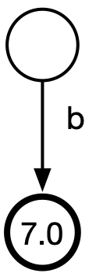
 	 
  	Figura 4: Seguendo la sequenza &lt;'b'&gt; dalla radice del trie di Figura 1, si raggiunge questo trie.

**Nota:** Ovviamente la sequenza `s` può contenere più di un elemento.

### 3.7. Iteratori

Gli iteratori puntano ad un nodo del trie e, quando vengono de-referenziati, devono restituire la variabile di tipo `T` che etichetta l'arco entrante nel nodo. Tenere presente che tutti i nodi hanno un arco entrante, eccetto la radice. Infatti, la radice sarà l'unico nodo il cui iteratore non deve essere de-referenziato. Per esempio, sia `it` un iteratore al nodo evidenziato in rosso in Figura 5. La de-referenziazione `*it` deve restituire una reference al carattere `c` che etichetta l'arco entrante nel nodo. 

	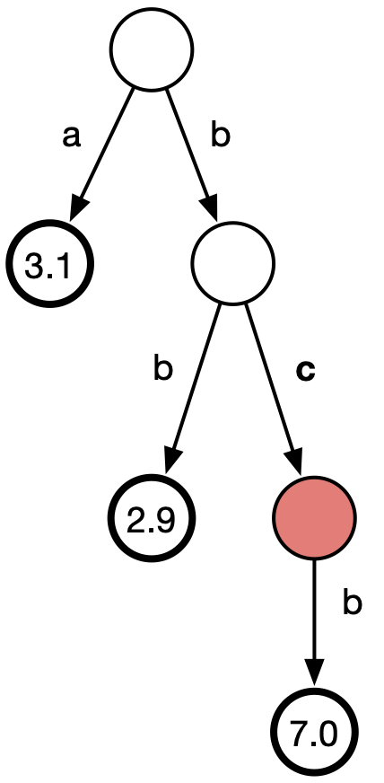
 	 
  	Figura 5: De-referenziando il nodo evidenziato in rosso, si ottiene la etichetta 'c'.

Prevediamo due tipi di iteratori, entrambi di tipologia `forward`. (Vi chiediamo di implementare entrambe le versioni const e non-const; per semplicità di seguito discutiamo solo la versione non-const).

Il primo iteratore è `node_iterator`.

	template <typename T>
	struct trie<T>::node_iterator;

Questo iteratore punta ad un qualsiasi nodo del trie. L'operatore `operator++` deve far puntare l'iteratore **al padre del nodo**. Dopo un certo numero di operazioni `++it`, si arriverà necessariamente alla radice. A questo punto `it` deve essere uguale a `trie<T>::root()`:

	template <typename T>
	node_iterator trie<T>::root();

Per comodità, il metodo `operator bool()` di `node_iterator` deve restituire `false` solo sulla radice (e quindi `true` su tutti gli altri nodi).

Il secondo iteratore è `leaf_iterator`.

	template <typename T>
	struct trie<T>::leaf_iterator;

Questo iteratore ci consente di navigare le foglie del trie da "sinistra a destra", **seguendo l'ordine lessicografico delle corrispondenti sequenze**.

L'operatore `operator++` deve spostare l'iteratore alla foglia successiva in questo ordine. Chiamando `operator++` sull'ultima foglia dell'ordine si deve ottenere un iteratore uguale a `trie<T>::end()` (vedi sotto).

I seguenti due metodi di `trie<T>` restituiscono un `leaf_iterator` alla prima foglia e alla foglia successiva all'ultima.

	template <typename T>
	leaf_iterator trie<T>::begin();
	
	template <typename T>
	leaf_iterator trie<T>::end();

**Nota:** Non ci sono metodi `begin()` e `end()` che restituiscono un iteratore di tipo `node_iterator` o `const_node_iterator`.

Il metodo

	operator node_iterator();

di `trie<T>::leaf_iterator` ci permette di convertire un `leaf_iterator` in un `node_iterator` che punta allo stesso nodo del trie.

Combinando le funzionalità dei due iteratori, possiamo per esempio estrarre tutte le sequenze contenute nel trie in ordine lessicografico, come mostrato nel seguente codice.

	/* assume t is a trie<T> */
	for (auto leaf_it = t.begin(); leaf_it != t.end(); ++leaf_it) {
		trie<T>::node_iterator node_it = leaf_it; // we convert leaf_it into node_it to navigate from leaf to root
		std::vector<T> s;
		while (node_it != t.root()) { // or simply while(node_it) by using operator bool() of node_iterator
			s.push_back(*node_it);
			++node_it;
		}
		std::reverse(s.begin(), s.end());
		for (auto const& x: s) std::cout << x << ' ';
		std::cout << '\n';
	}

**Nota importante:** Gli iteratori devono funzionare in modo consistente anche su *sotto-tries*.
Per far ciò, è essenziale fornire un'accurata implementazione dei metodi `root()`, `begin()` e `end()` di `trie<T>`. Infatti, notare che su un sotto-trie, tali metodi restituiranno iteratori alla radice/prima foglia/foglia successiva all'ultima foglia del *sotto-trie* che **non** necessariamente coincidono con la radice/prima foglia/foglia successiva all'ultima foglia del trie dal quale è stato istanziato il sotto-trie. Per esempio, considerate il trie di Figura 1. Chiamiamo questo trie `t`.
Su questo trie, `t.begin()` è quindi un `leaf_iterator` alla foglia di peso `3.1`, mentre `t.end()` è un `leaf_iterator` alla posizione successiva alla foglia di peso `7.0`. Considerate ora il trie `t2` costruito come segue:

	std::vector<char> prefix{'b'};
	auto t2 = t[prefix];
	for (auto it2 = t2.begin(); it2 != t2.end(); ++it2) {
		std::cout << *it2 << ' ';
	}

Su questo trie, `t2.begin()` è quindi un `leaf_iterator` alla foglia di peso `2.9`, mentre `t2.end()` è un `leaf_iterator` alla posizione successiva alla foglia di peso `7.0`. In altre parole, il `for` loop del codice sopra deve correttamente navigare solo due foglie e stampare `b b`. Testate accuratamente queste funzionalità del vostro codice!

Infine, il metodo

	template <typename T>
	trie<T> const& trie<T>::leaf_iterator::get_leaf() const;

restituisce una const reference alla foglia puntata dall'istanza di `leaf_operator` sul quale è chiamato.

### 3.8. Foglia di peso massimo

I metodi

	template <typename T>
	trie<T>& trie<T>::max();
	
	template <typename T>
	trie<T> const& trie<T>::max() const;

Devono restituire una reference/const-reference alla foglia di peso massimo. Per esempio, sia `t` il `trie<std::string>` di Figura 6.

	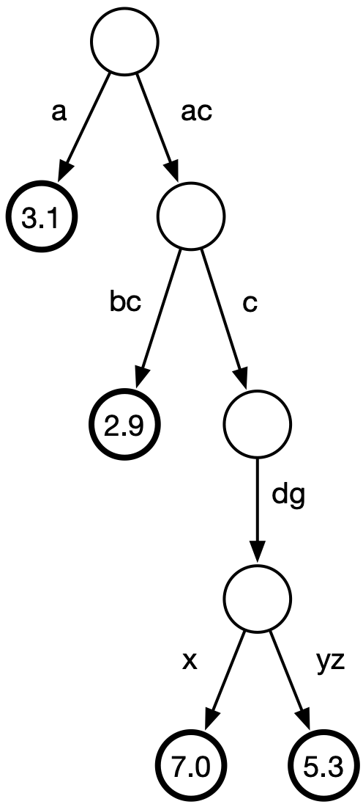
 	 
  	Figura 6: Esempio di trie&lt;std::string&gt.

Allora `t.max()` è la foglia (di peso massimo 7.0) raggiunta leggendo la sequenza di stringhe `<"ac","c","dg","x">`. Notare che la stessa foglia si ottiene con il seguente codice (all'interno della variabile `x`):

	std::vector<std::string> s{"ac","c"};
	auto x = t[s].max();

La sintassi `t[s].max()` ci permette quindi di raggiungere la foglia di peso massimo la cui sequenza associata inizia con la sequenza `s`.

### 3.9. Metodi facoltativi

I seguenti metodo sono facoltativi e conferiscono fino ad un massimo di **4 punti aggiuntivi** se implementati correttamente.

#### 3.9.1. Unione

I seguenti metodi

	template <typename T>
	trie<T> trie<T>::operator+(trie<T> const&) const;
	
	template <typename T>
	trie<T>& trie<T>::operator+=(trie<T> const&);

implementano l'unione di due oggetti `trie<T>`. Nel primo caso, l'operatore non modifica gli operandi e restituisce un nuovo `trie<T>`. Nel secondo caso, l'operatore aggiunge l'operando di destra a quello di sinistra, e restituisce una reference all'operando di sinistra.

La semantica dei due operatori sopra è **l'unione insiemistica**, facendo attenzione ai pesi e alle sequenze prefisso di altre sequenze.
Consideriamo alcuni esempi.

	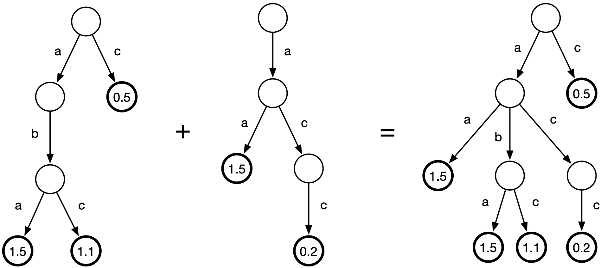
 	 
  	Figura 7: Esempio di unione tra due trie&lt;char&gt.

Nell'esempio di Figura 7 gli insiemi delle sequenze dei due tries sono disgiunti. Più in generale, gli insieme possono non essere disgiunti e i pesi delle sequenze condivise vanno sommati nel risultato. In altre parole, se entrambi gli insiemi (operandi) contengono la stessa sequenza pesata `(x,u)` e `(x,v)` (i due pesi associati alla sequenza `x` nei due operandi sono `u` e `v`), il risultato deve contenere la sequenza pesata `(x,u+v)`.
Si consideri l'esempio di Figura 8.

	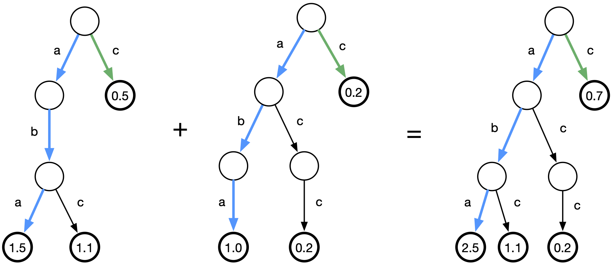
 	 
  	Figura 8: Esempio di unione tra due trie&lt;char&gt.

Nell'esempio di Figura 8, la sequenza `aba` è presente in entrambi gli insiemi con peso rispettivamente `1.5` e `1.0` (cammino evidenziato in azzurro), pertanto nel risultato compare con peso `1.5 + 1.0 = 2.5`. Stesso discorso per la sequenza `c` (cammino evidenziato in verde).

Più in generale: se un operando contiene la sequenza pesata `(x,u)`, nel risultato il peso `u` deve essere sommato al peso di tutte le sequenze `(y,v)` dell'altro operando tali che `x` è un prefisso di `y`. Si consideri l'esempio di Figura 9.

	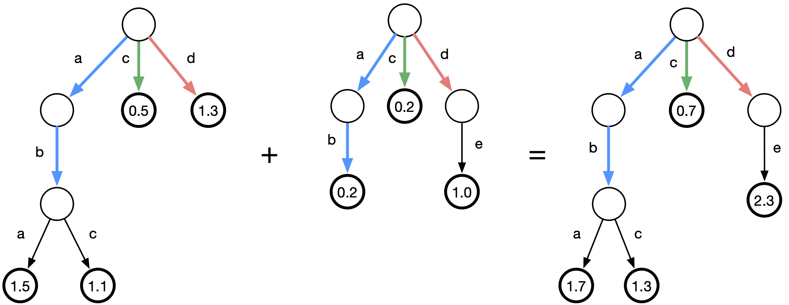
 	 
  	Figura 9: Esempio di unione tra due trie&lt;char&gt.

Nell'esempio di Figura 9, la sequenza `ab` (di peso `0.2`) del secondo insieme (cammino evidenziato in azzurro) è un prefisso della sequenza `abc` nel primo insieme, di peso `1.1`. Nel risultato quindi la sequenza `abc` deve aver peso pari a `1.1 + 0.2 = 1.3`. Stesso discorso per la sequenza `aba`, che nel risultato deve aver peso pari a `1.5 + 0.2 = 1.7`. In modo analogo, la sequenza `d` del primo insieme (cammino evidenziato in rosso) è un prefisso della sequenza `de` del secondo insieme, quindi `de` nel risultato deve avere peso pari alla somma di queste due sequenze: `1 + 1.3 = 2.3`.

**Suggerimento:** Implementare questi operatori in modo ricorsivo.

#### 3.9.2. Compattazione

Il metodo

	template <typename T>
	void trie<T>::path_compress();

deve compattare i cammini *unari* nel trie, ossia cammini massimali formati da nodi con un solo figlio (e dal loro arco entrante e unico arco uscente). La compattazione deve avvenire sostituendo questo cammino con un solo arco la cui etichetta è costruita combinando le etichette degli archi coinvolti nel cammino unario tramite `operator+` del tipo `T`. Il metodo deve modificare il trie sul quale è chiamato.

Vediamo alcuni esempi.

Se `T=std::string`, allora la semantica di `operator+` è quella della **concatenazione tra stringhe**. Quindi il trie di Figura 6 viene compattato come segue:

	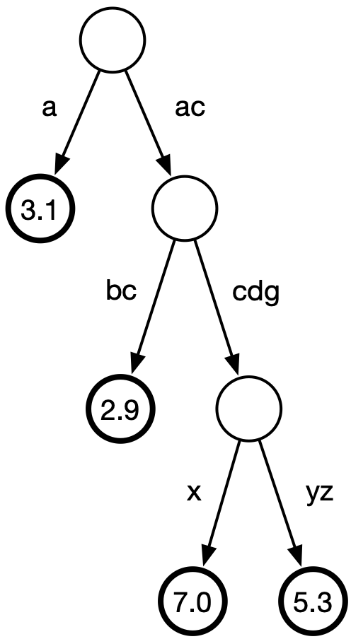
 	 
  	Figura 10: Compattazione del trie di Figura 6 in cui il cammino "c" --> "dg" viene compattato in "cdg"

Nel precedente esempio un solo cammino è stato compattato, ma in generale ci possono essere diversi cammini unari nello stesso trie. Un cammino potrebbe anche terminare in una foglia. 

Altro esempio. Se `T=int`, allora la semantica di `operator+` è quella della **somma tra interi**. Otteniamo quindi che il `trie<int>` di Figura 11

	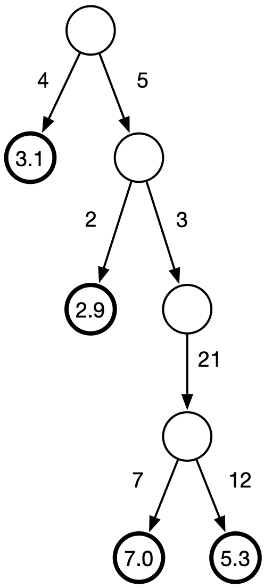
 	 
  	Figura 11: Esempio di trie&lt;int&gt;.

viene compattato in quello di Figura 12.

	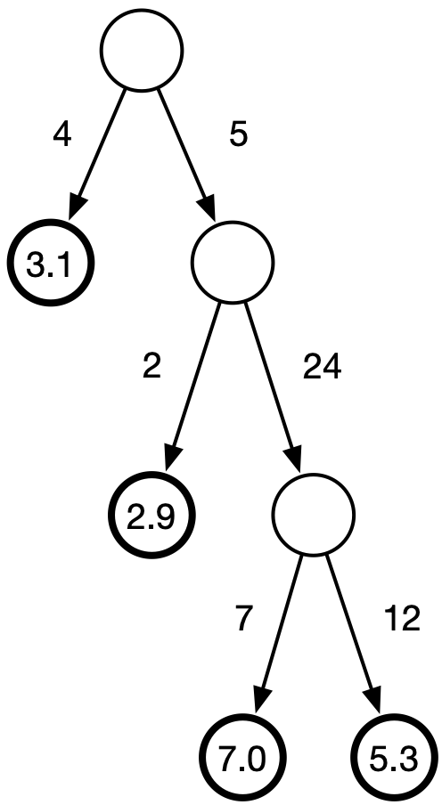
 	 
  	Figura 12: Compattazione del trie di Figura 11.

## 4. Come testare il vostro codice?
 
Ricordate la regola generale: la scrittura del codice è solo metà del lavoro! La metà rimanente consiste nel progettare dei test approfonditi per rilevare eventuali bug. In fase di valutazione, il nostro compito sarà quello di mettere sotto stress il vostro codice (testandolo sui file più disparati, sia in formato trie valido che non, e combinando operatori in tutti i modi possibili), quindi progettate degli ottimi test e ricordatevi di compilare il codice con gli strumenti di debug mostrati a lezione (assert e compiler sanitizers). Ricordatevi anche di usare Valgrind.
 
Detto questo, consigliamo di crearvi un file `tools/test.cpp` in cui definirete una funzione `main` che testa l'oggetto `trie<T>` da voi scritto. Questo file `test.cpp` **non** deve essere tuttavia consegnato (dovrete consegnare `trie.cpp` e `bag.hpp`, leggi sotto): serve solo a voi per testare il vostro codice. Testate ogni metodo di `trie<T>` in maniera isolata, su molti test case.

Verificate che non ci siano memory leaks. L'output di Valgrind deve sempre terminare con:

	ERROR SUMMARY: 0 errors from 0 contexts (suppressed: 0 from 0)

Ogni errore di memoria che troveremo verrà penalizzato. 

Per semplicità, consigliamo di includere `src/trie.cpp` nel file `tools/test.cpp` in fase di testing.
 
## 5. Consegna del progetto

Noi vi forniamo il file `include/trie.hpp` (in questo repository GitHub) che contiene le dichiarazioni della classe e gli unici `#include` ammessi. 

Il vostro compito sarà quello di implementare i file `src/trie.cpp` e `include/bag.hpp`.

Note importanti: 

1. `trie.cpp` può solo includere `trie.hpp`. Non può contenere nessun altra direttiva `#include` e nessuna macro. Stesso discorso per `bag.hpp` Tutti gli include e macro verranno automaticamente rimossi prima di compilare il vostro codice. Gli unici `#include` ammessi sono quelli presenti nei file `trie.hpp`, `trie.cpp` e `bag.hpp` forniti da noi.
2. `trie.cpp` **non** deve definire la funzione `main`: saremo noi a scriverla per testare il vostro codice. Se definite la funzione `main`, il codice non compilerà in fase di valutazione del progetto.

### Formato e link per la consegna

Ogni studente deve consegnare i file `trie.cpp` e `bag.hpp` (con **esattamente** questi nomi), contenuti dentro ad una cartella il cui nome deve essere la matricola dello studente, archiviata e compressa in un file `tar.gz` creato come descritto qui sotto. Questo archivio è l'unico file che va consegnato tramite il modulo moodle che troverete sulla pagina Moodle del corso. 

Esempio: se la mia matricola è 012345 e mi trovo dentro alla cartella del progetto (con la struttura di questo repository GigHub), per creare l'archivio devo seguire i seguenti passi (da terminale Ubuntu):

    mkdir 012345
    cp src/trie.cpp include/bag.hpp 012345
    tar -zcvf 012345.tar.gz 012345

Questi passi creano il file `012345.tar.gz`, che deve essere consegnato tramite Moodle. Se volete verificare che la creazione dell'archivio sia andata a buon fine, il seguente comando estrae l'archivio:

    tar -xvzf 012345.tar.gz

Seguite **esattamente** queste istruzioni. Qualsiasi altra cosa (archivio non in formato `tar.gz`, nome cartella sbagliato, nome file diversi da `trie.cpp` e `bag.hpp`, etc.) porterà all'esclusione automatica del progetto. 

Le scadenze estive sono:

- 15 giugno;
- 15 luglio.

I seguenti appelli saranno a settembre e gennaio. 

Il modulo Moodle per la consegna verrà aperto a breve e potrete cominciare a consegnare da subito. Potete caricare il progetto su Moodle un numero illimitato di volte. Ad intervalli regolari (solitamente, una volta alla settimana) noi scarichiamo tutti i progetti consegnati e li testiamo, caricando i risultati parziali su Moodle. La valutazione definitiva del progetto viene fatta solo dopo la scadenza per le consegne.

## 6. Valutazione del progetto

Ogni metodo da voi scritto verrà testato da noi in modo accurato, su molti input diversi (file `trie<T>` sia in formato valido che non, su diversi tipi `T`). Su file `trie<T>` in formato non valido, ci aspettiamo che il vostro codice lanci eccezioni `parser_exception` (ogni eccezione non lanciata porta alla perdita di alcuni punti). Sta a voi identificare tutti gli errori possibili di formato: lavorate molto bene sul parser!

Compileremo il vostro codice con lo standard C++ 17 (compiler flag `-std=c++17`).

Un metodo che porta all’interruzione inaspettata del codice (esempio, `segmentation fault`) viene valutato 0 punti. Un metodo non implementato viene valutato 0 punti. Alcuni metodi, come quelli su iteratori, sono molto importanti perché ci permettono di testare il vostro codice (accedendo al contenuto del container): fate attenzione ad implementarli correttamente, altrimenti non avremo modo di testare il vostro codice. 

### Timeout

Attenzione: il vostro codice deve essere ragionevolmente veloce. Imposteremo un timeout di qualche minuto (in realtà dovrebbero bastare pochi millisecondi) per la lettura di file e costruzione del container corrispondente (vedi cartella dataset/ per alcuni esempi).

### Plagi

I vostri codici verranno confrontati utilizzando un rilevatore di plagi. Questo strumento è in grado di rilevare tentativi di mascherare copiature di codice come rinomina di variabili, conversione di cicli for in cicli while, etc. In caso di plagio rilevato, tutti gli studenti coinvolti:

- Dovranno ripetere l'esame l'anno prossimo. Il voto del modulo 1, se già passato, viene annullato.
- verranno segnalati alla commissione disciplinare di ateneo, che valuterà come procedere (si può arrivare all'espulsione, come per tutti i casi di copiatura ad esami).

Se uno degli studenti coinvolti ha già passato l'esame (e ha quindi fornito il proprio codice ad uno studente che deve ancora sostenere l'esame), annulleremo la verbalizzazione dell'esame. Lo studente dovrà ripetere l'esame l'anno prossimo e segnaleremo il caso alla commissione disciplinare di ateneo.

Tenete bene a mente queste semplici regole: 

1. **Mai** passare il codice ad uno compagno che deve ancora sostenere l’esame. Costui infatti potrebbe copiare (anche solo in parte), con la conseguenza che entrambi non passerete l’esame. Discutere idee generali sulla soluzione va bene, ma il codice non deve mai essere condiviso. 
2. Non postate porzioni del vostro codice online (per esempio, su forum). Altri studenti potrebbero copiare il codice ed entrambi non passerete l’esame (in passato è successo anche questo).

## 7. GitHub issues

Se trovate imprecisioni/errori o volete un chiarimento su parti di questo documento o di `trie.hpp`, aprite una GitHub issue (pulsante "issues" in alto) citando la linea del file in questione (se il commento riguarda una linea particolare del codice o di questo README). Per citare una particolare linea di README.md, aprite il file (cliccando su README.md in alto), rendete visibili le linee (pulsante `<>` "display the source blob"), selezionate i numeri di linea interessati -> cliccate i tre puntini -> "copy permalink". A questo punto, potete incollare il link copiato nella issue. Analogo per trie.hpp (in questo caso i numeri di linea sono immediatamente visibili).
